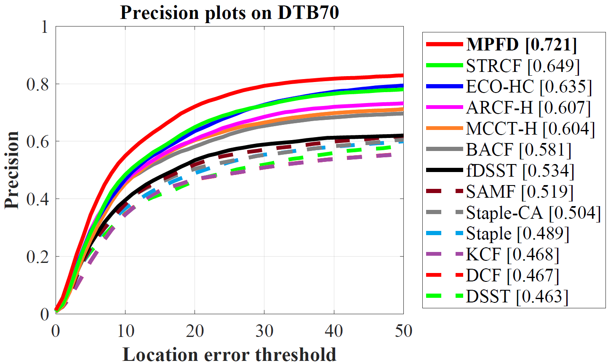
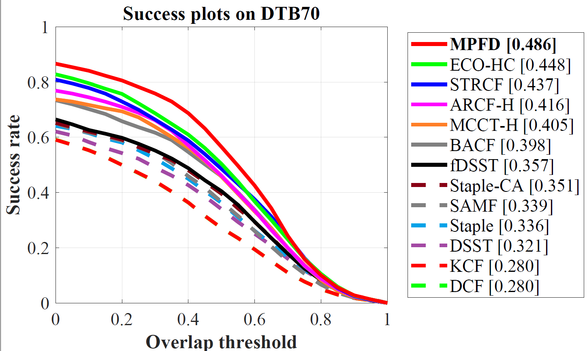
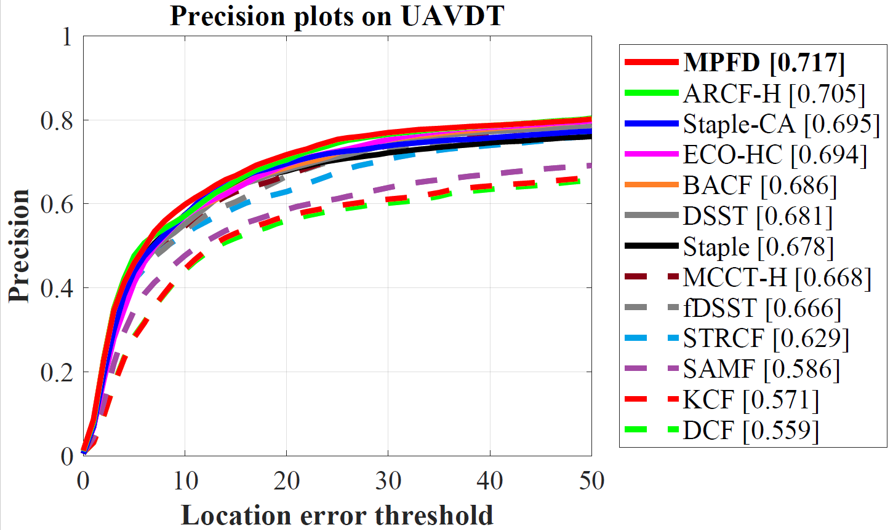
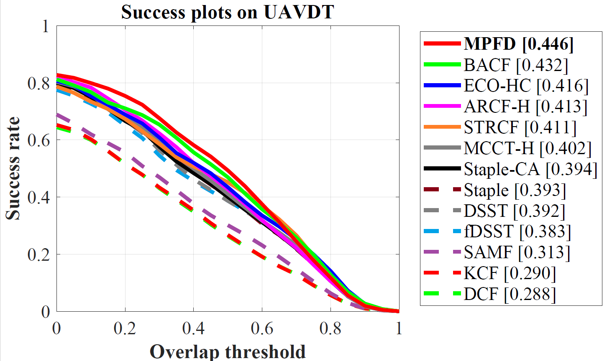
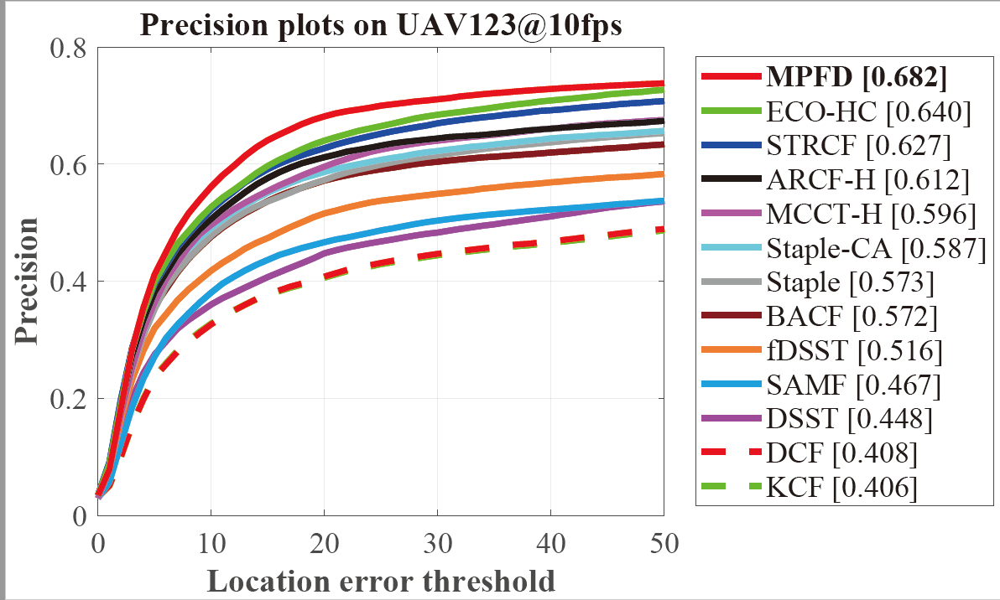
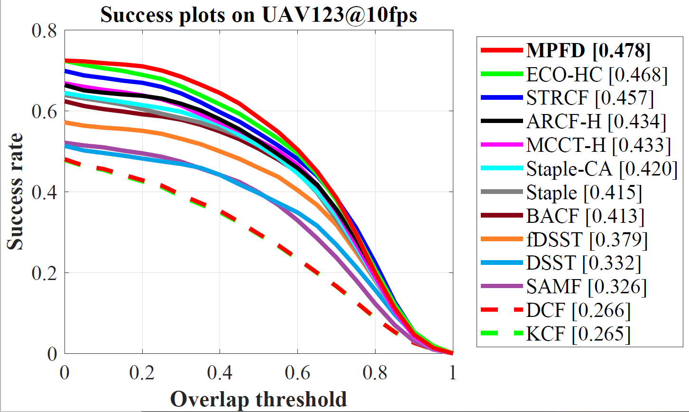

# Joint Robust Model Prediction and Filters Distillation for Real-Time UAV Tracking

Matlab implementation of our Model Prediction and Filters Distillation tracker (MPFD Track).

# Abstract

Correlation filters (CFs), by virtue of their high computational efficiency, have achieved remarkable popularity in unmanned aerial vehicle (UAV) applications. In literature, most existing CF-based trackers generally train the filters with the summation of past samples in order to promise temporal consistency. However, the information in the upcoming image, which is quite valuable in UAV scenarios where target may undergo severe appearance variations between two consecutive frames, is discarded in these trackers and thus the trackers always fail to catch the target. To get rid of such a dilemma, in this work, a prediction model built by fully exploiting the future information aforementioned is proposed to equip the filter with better discrimination between the coming target appearance and the background. Moreover, to repress the insidious influence of unreliable historic samples, a novel filter distillation method is proposed to alleviate filter corruption. Extensive experiments on three challenging UAV benchmarks have demonstrated the superior accuracy of the proposed method with real-time (>30fps) tracking speed.

# Publication

MPFD Track is proposed in our paper for TASE. Detailed explanation of our method can be found in the paper:

Changhong Fu, Teng Li,  Yiming Li,  Jin Jin and Ziang Cao.

Joint Robust Model Prediction and Filters Distillation for Real-Time UAV Tracking

# Contact

Changhong Fu

Email: [changhong.fu@tongji.edu.cn](mailto:changhong.fu@tongji.edu.cn)

Teng Li

Email:  18621131431@163.com

# Demonstration running instructions

This code is compatible with  DTB70, UAVDT and UAV123@10fps benchmark. Therefore, if you want to run it in benchmark, just put DR2Track folder in trackers, and config sequences and trackers according to instructions from aforementioned benchmarks. 

# Results on UAV datasets

### DTB70

### UAVDT

### UAV123@10fps

# Acknowledgements

We thank the contribution of  Feng Li, Ning Wang and Martin Danelljan for their previous work STRCF,  MCCT-H and DSST.  The feature extraction modules and some of the parameter are borrowed from the MCCT tracker (https://github.com/594422814/MCCT). The scale estimation method is borrowed from the DSST tracker (http://www.cvl.isy.liu.se/en/research/objrec/visualtracking/scalvistrack/index.html).
